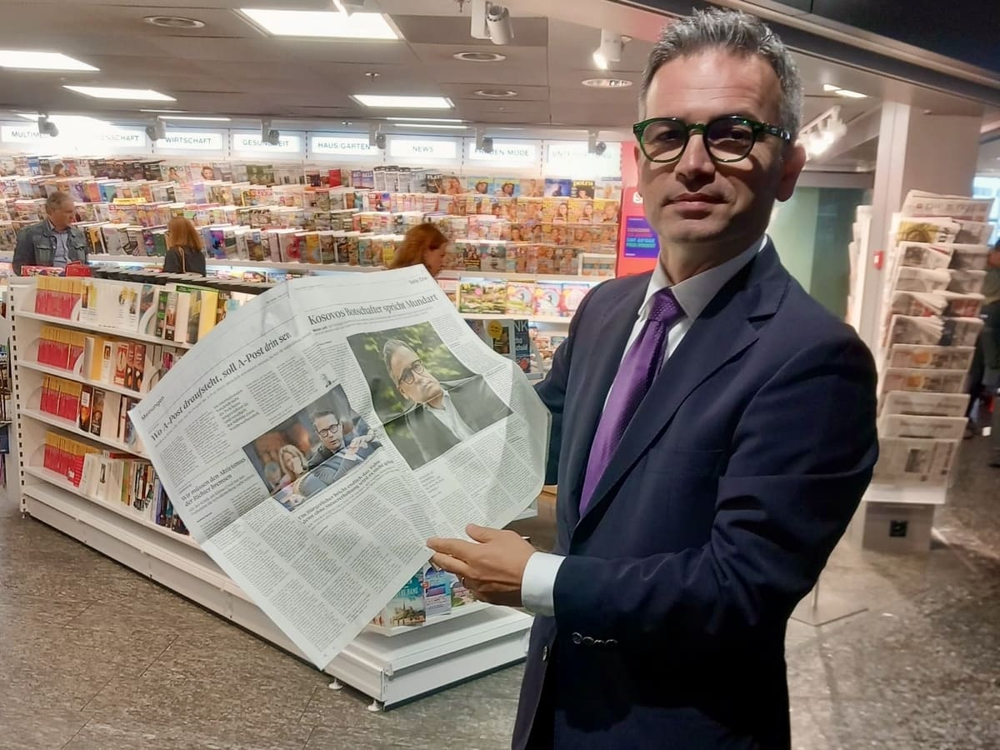

+++
title = "Geprägt von zwei Welten: Die Entwicklung der Identität"
date = "2025-02-28"
draft = false
pinned = false
tags = []
image = "istockphoto-1082440228-612x612.jpg"
description = "Von zwei Kulturen geprägt zu sein bedeutet, sich selbst immer wieder neu zu definieren."
+++
Mentor Latifi ist Diplomat und derzeit Botschafter des Kosovo in der Schweiz und Liechtenstein. Geboren 1974 im Kosovo, emigrierte er 1991 mit seiner Familie in die Schweiz. 

> "Es war der schwierigste Teil meines Lebens!" - Mentor Latifi

Trotz Herausforderungen erhielt er die Möglichkeit, das Gymnasium in Zofingen zu absolvieren, bevor er an der Universität Basel studierte. 2005 kehrte er nach seiner Heirat in den Kosovo zurück. Zwei Jahrzehnte später vertritt er sein Heimatland als Botschafter in jenem Land, das ihm einst selbst Chancen eröffnete.

**Was bedeutet Identität für Sie?**

Identität ist etwas, das einen von anderen unterscheidet. Es definiert uns, auch wenn wir vielleicht nie explizit darüber nachdenken. Ich bin im Kosovo und im ehemaligen Jugoslawien aufgewachsen, einem Land mit vielen verschiedenen Nationen. Dadurch waren viele Identitäten miteinander vermischt. Je nachdem, welche Identität man hatte, konnte man auf der Sonnenseite oder der Schattenseite der Geschichte stehen. Kurz gesagt: Identität macht uns zu dem, was wir sind.

**Wurde über Identität gesprochen, als Sie jünger waren?**

Nein, explizit haben wir darüber nie gesprochen – bis heute in diesem Moment. Aber als ich aufwuchs und meine eigene Identität entwickelte, wurde ich, wie viele andere auch, für das bestraft, was ich war, wie ich sprach und was ich wollte. Das führte automatisch dazu, dass ich mich mit Menschen verbunden fühlte, die dieselbe Sprache sprachen und ähnliche Gedanken hatten wie ich. So entstand eine gemeinsame Identität innerhalb unserer Gemeinschaft.

**Wovon wird die Identität Ihrer Meinung nach am meisten beeinflusst?**

Vor allem von äußeren Faktoren. Wenn man mit verschiedenen Identitäten konfrontiert wird, kann es passieren, dass man anfängt zu denken, die eigene sei nicht so gut oder nicht so wichtig. Aber letztlich spielt es keine Rolle, welche Identität man hat – wir sind alle Menschen, und das ist das Wichtigste. Der Austausch mit anderen Identitäten ist vielleicht das beste Mittel, um mehr über sich selbst und andere zu erfahren.

**Hat sich Ihre Vorstellung von Identität verändert, als Sie in die Schweiz gezogen sind?**

In gewisser Weise ja. Einerseits wurde meine Identität stärker, andererseits hat sie sich auch verändert. Ich habe viele neue Perspektiven und Sichtweisen kennengelernt. Gleichzeitig war ich in der Schweiz auch von Menschen umgeben, die meine Identität teilten. Das hat meinen Bezug zu ihr noch gefestigt oder mir zumindest bewusster gemacht, was meine Identität ausmacht.

**Wie unterscheidet sich Ihre Identität von der Ihrer Eltern oder Großeltern?**

Es gibt eine gewisse Kontinuität – man kann sehen, dass Identität von Generation zu Generation weitergegeben wird. Gleichzeitig gibt es aber auch viele Dinge, die sich verändern. Jede Generation bringt neue Erfahrungen mit sich, die ihre Identität prägen.

> "Identität ist nicht festgelegt; sie entwickelt sich im Laufe der Zeit." 

**Denken Sie, dass jüngere Generationen Identität anders erleben als Ihre oder frühere Generationen?**

Ja, das denke ich – und ich hoffe es auch. Jede neue Generation sollte einen Schritt nach vorne machen, um die Welt zu einem besseren Ort zu machen und weniger Probleme mit der eigenen oder der Identität anderer zu haben. Heute ist die Welt durch das Internet und soziale Medien viel vernetzter. Das verändert den Blick auf Identität grundlegend, im Vergleich zu meiner Generation oder der meiner Eltern.

**Als Sie in die Schweiz kamen, wurden Sie mit einer völlig neuen Sprache und Kultur konfrontiert. Glauben Sie, dass Sprache die Identität prägt?**

Ja, auf jeden Fall. Sprache eröffnet Horizonte. Ich komme aus einer Kultur, in der die Sprache das verbindende Element ist. Wir legen weniger Wert auf Religion oder andere Faktoren – für uns ist Sprache essenziell. Wenn man sie verliert, ist es schwierig, Teil der alten Identität zu bleiben. Deshalb ist es mir auch sehr wichtig, dass meine Kinder unsere Sprache behalten.

**Wie unterscheidet sich die Identität Ihrer Kinder von Ihrer eigenen?**

 Wie bereits gesagt, haben sie wahrscheinlich eine andere Sicht auf die Welt – und das ist gut so. Sie werden andere Werte und Vorstellungen entwickeln. Trotzdem hoffe ich, dass sie einen Teil unserer Identität bewahren – vor allem die Sprache. Ich wünsche mir, dass sie unsere Sprache weiter sprechen, wertschätzen und weiterentwickeln.